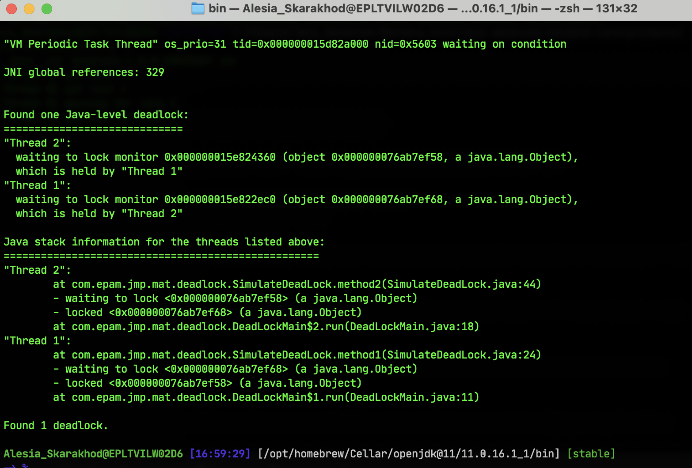
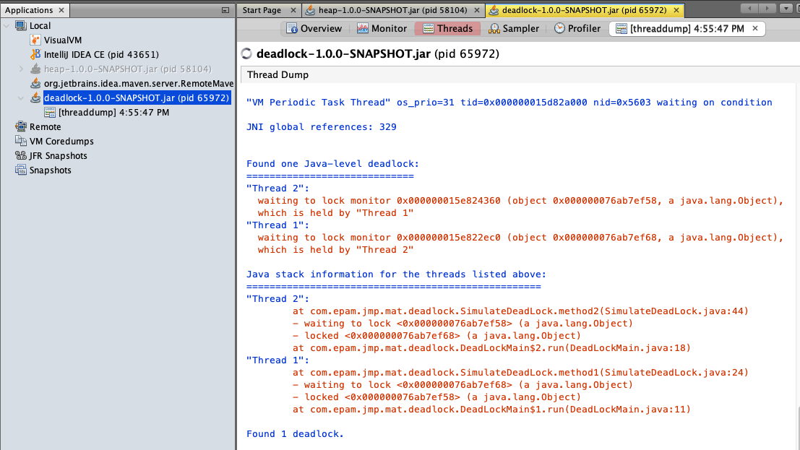
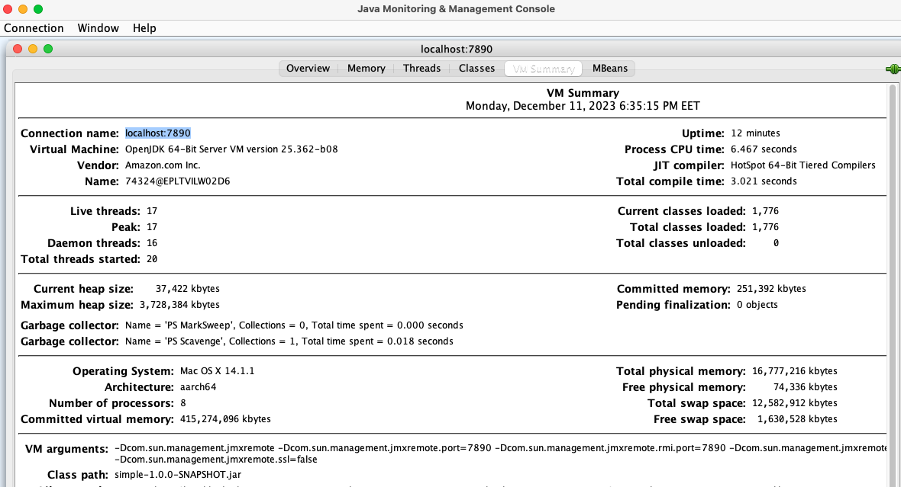
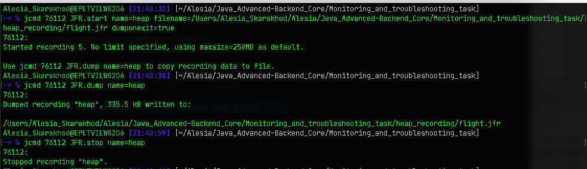

# Deadlock troubleshooting

## I. Get deadlock
- Execute java application that simulates deadlock:
  ```
    java -jar deadlock-1.0.0-SNAPSHOT.jar
  ```
- Get `thread dump` using:

1. `jcmd`and `jstack`:

    ```
        jcmd <pid> Thread.print
    ```
    ```
        jstack -l <pid>
    ```
   

3. `jvisualvm`:
   

## II. Remote JVM profiling
- Using [JMX Technology](https://docs.oracle.com/javase/8/docs/technotes/guides/management/agent.html)
- For insecure remote connection use parameters:
  ```
  java -Dcom.sun.management.jmxremote \
     -Dcom.sun.management.jmxremote.port=7890 \
     -Dcom.sun.management.jmxremote.rmi.port=7890 \
     -Dcom.sun.management.jmxremote.authenticate=false \
     -Dcom.sun.management.jmxremote.ssl=false \
     -jar simple-1.0.0-SNAPSHOT.jar
  ```
- Connect to JVM using `jconsole`:
```
    jconsole localhost:7890
```



## III. Inspect a Flight Recording
- Execute JVM with two special parameters:
  ```
  java -XX:+UnlockCommercialFeatures \
  -XX:+FlightRecorder \
  -XX:StartFlightRecording=dumponexit=true,filename=flight.jfr \
  -Xmx100m -jar heap-1.0.0-SNAPSHOT.jar

  ```
  - Enable Flight Recording on JVM without these parameters:
    ```
      java -jar -Xmx100m -XX:+UnlockCommercialFeatures heap-1.0.0-SNAPSHOT.jar
    ```
    ```
      jps -lvm
    ```
    - for example: **`78112`**
    ```
      jcmd 76112 JFR.start name=heap filename=flight.jfr dumponexit=true
    ```
    ```
      jcmd 76112 JFR.dump name=heap
      jcmd 76112 JFR.stop name=heap
    ```



## IV. jinfo

- Print system properties and command-line flags that were used to start the JVM.
  ```
    java -jar simple-1.0.0-SNAPSHOT.jar
    jps
    jinfo <pid>
  ```