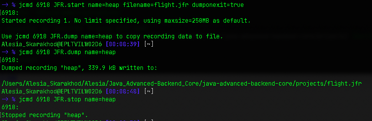

### Inspect a Flight Recording

## I. Execute JVM with two special parameters:
  ```
    java -XX:+FlightRecorder \
    -XX:StartFlightRecording=dumponexit=true,filename=flight.jfr \
    -Xmx100m -jar heap-1.0.0-SNAPSHOT.jar
  ```

## II. Enable Flight Recording on JVM without these parameters:

  ```
    java -jar -Xmx100m heap-1.0.0-SNAPSHOT.jar
  ```
  ```
    jps -lvm
  ```
    - for example: **`6918`**
  ```
    jcmd 6918 JFR.start name=heap filename=flight.jfr dumponexit=true
  ```
  ```
    jcmd 6918 JFR.dump name=heap
    jcmd 6918 JFR.stop name=heap
  ```




**Note**: -XX:+UnlockCommercialFeatures isn't needed for Java 11 and later.