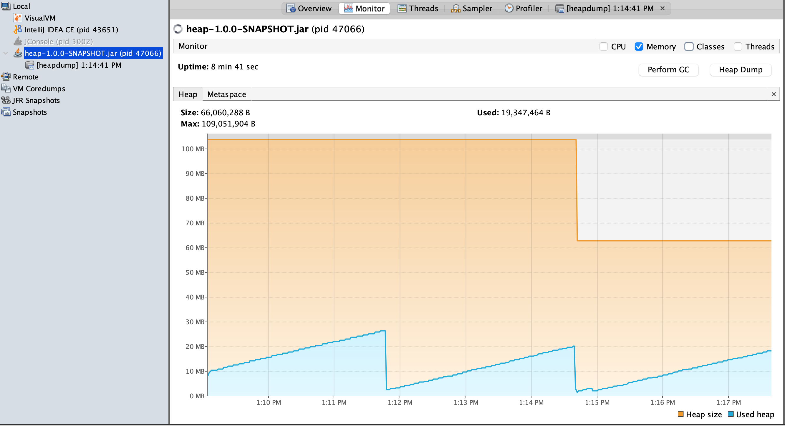
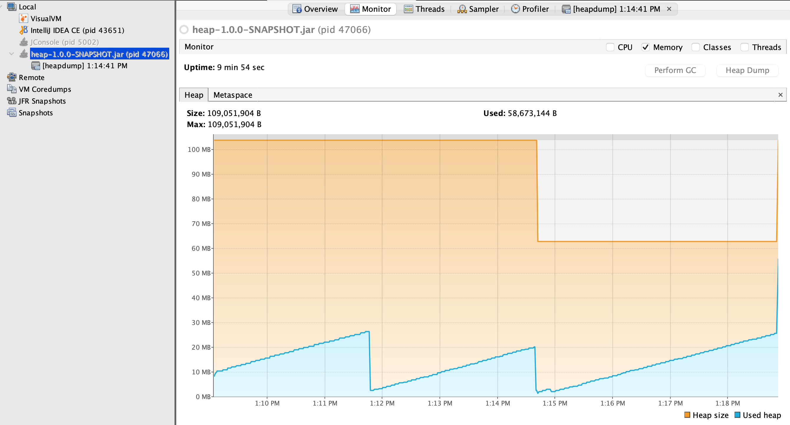
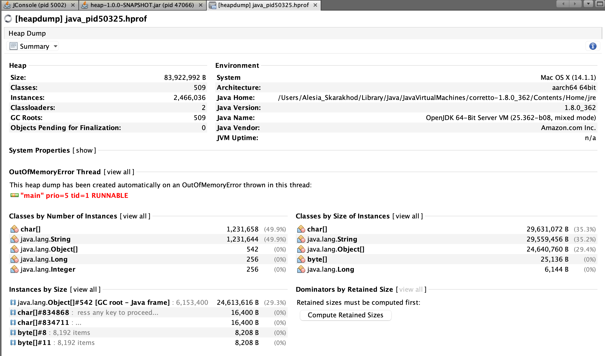
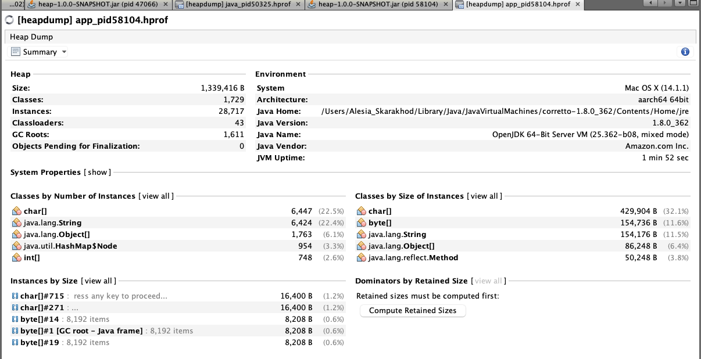
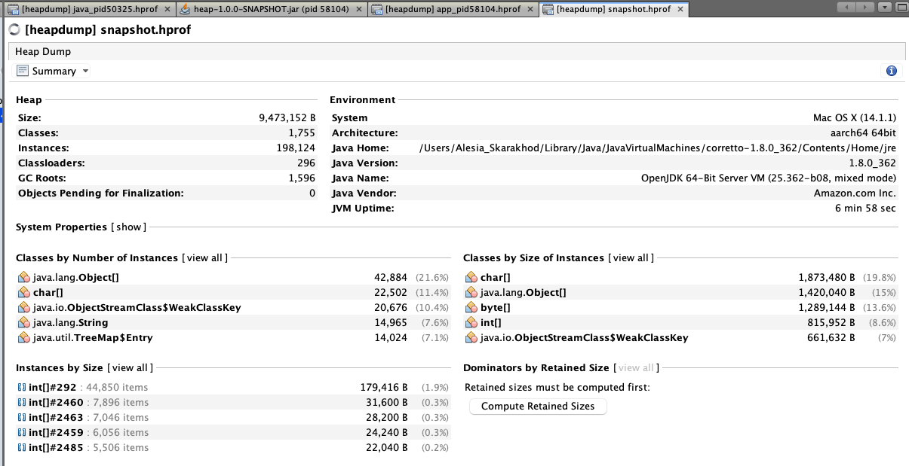
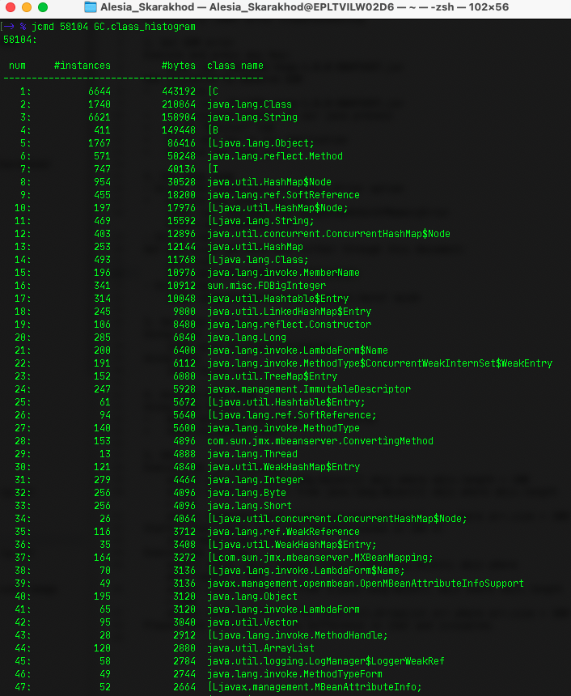
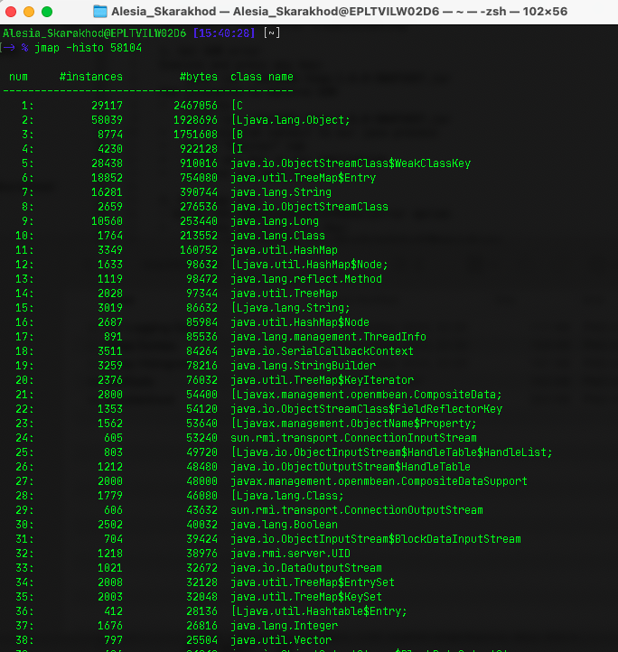
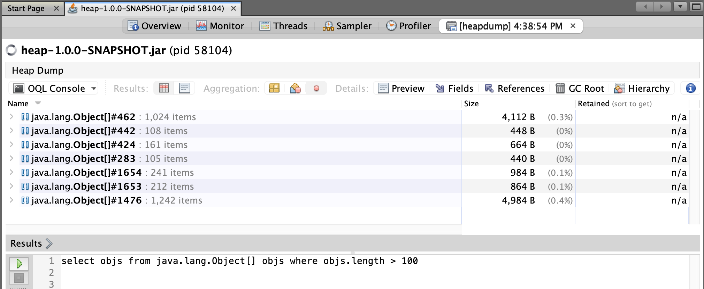
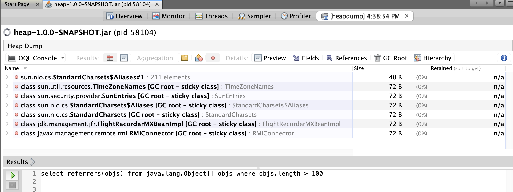
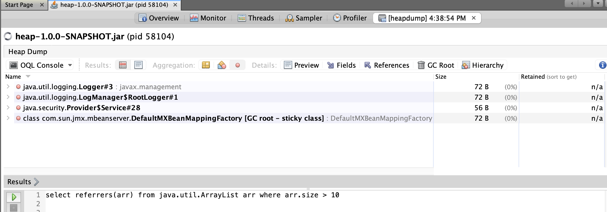

# OutOfMemory (OOM) error troubleshooting

## I. Get OOM error

1. Execute and press any key:

  ```
    java -jar -Xmx100m heap-1.0.0-SNAPSHOT.jar
  ```



2. Use `jvisualvm` to observe OOM:
- Execute:
  ```
  java -jar -Xmx100m heap-1.0.0-SNAPSHOT.jar
  ```
- In jvisualvm, connect to our Java process.
- Go to the "Monitor" tab.
- Press any key in our application.
- Observe how the heap grows.

  

## II. Get heap dump

1. Using `-XX:+HeapDumpOnOutOfMemoryError` option:

```
java -jar -Xmx100m -XX:+HeapDumpOnOutOfMemoryError heap-1.0.0-SNAPSHOT.jar
```



2. Using `jcmd`:

- Get pid using jps: 
```
jps -lvm
```
- for example: **`58104`**
- Then, execute (`jcmd <pid> GC.heap_dump <filename>`):
  ```
  jcmd 58104 GC.heap_dump app_pid58104.hprof
  ```



3. Using `jmap`:

```
jmap -dump:format=b,file=snapshot.hprof 58104
```



## III. Get heap histogram

1. Using `jcmd`:
- command - `jcmd <pid> GC.class_histogram`
```
jcmd 58104 GC.class_histogram
```



2. Using `jmap`:

- `jmap -histo <pid>`
```
jmap -histo 58104
```



## IV. Analyze heap dump

1. Using `Java Visual VM`:
- Open the retrieved heap dump in `jvisualvm`.
- Identify the memory leak.

## V. OQL

1. Execute OQL in `jvisualvm`:

```
select objs from java.lang.Object[] objs where objs.length > 100
```


```
select referrers(objs) from java.lang.Object[] objs where objs.length > 100
```


```
  select referrers(arr) from java.util.ArrayList arr where arr.size > 100**
```



2. Startup `jhat` (note: jhat was decommissioned in JDK 9):

- command - `jhat <heap_dump.hprof>`
- Execute OQL in `jhat`
```
select [objs, objs.length] from [Ljava.lang.Object; objs where objs.length > 100
```
```
  select referrers(objs) from [Ljava.lang.Object; objs where objs.length > 100
```
```
  select referrers(arr) from java.util.ArrayList arr where arr.size > 100**
```

**Note**: There are small OQL syntax differences between jhat and jvisualvm.


