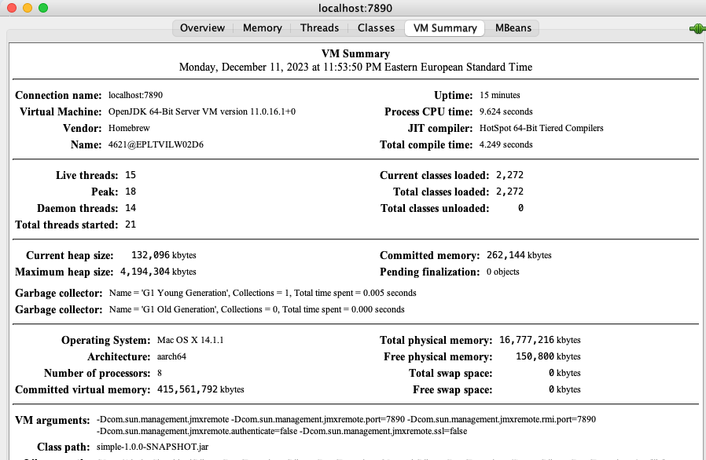

### Remote JVM profiling
## I. Using [JMX Technology](https://docs.oracle.com/javase/8/docs/technotes/guides/management/agent.html)
- For insecure remote connection use parameters:
  ```
  java -Dcom.sun.management.jmxremote \
     -Dcom.sun.management.jmxremote.port=7890 \
     -Dcom.sun.management.jmxremote.rmi.port=7890 \
     -Dcom.sun.management.jmxremote.authenticate=false \
     -Dcom.sun.management.jmxremote.ssl=false \
     -jar simple-1.0.0-SNAPSHOT.jar
  ```
- Connect to JVM using `jconsole`:
```
    jconsole localhost:7890
```

