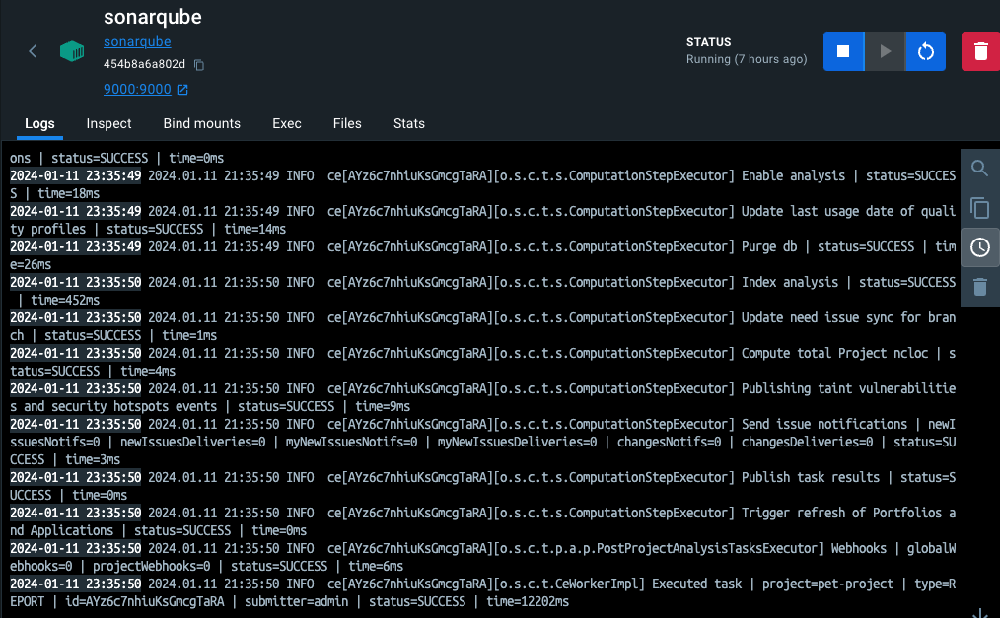
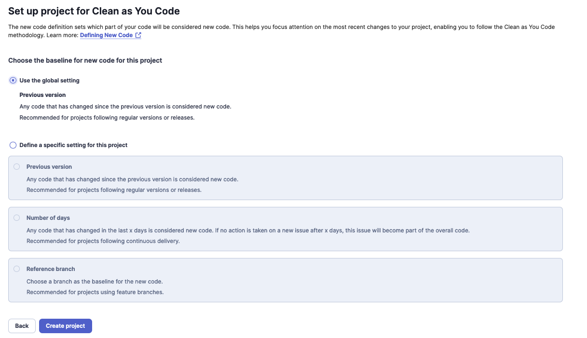
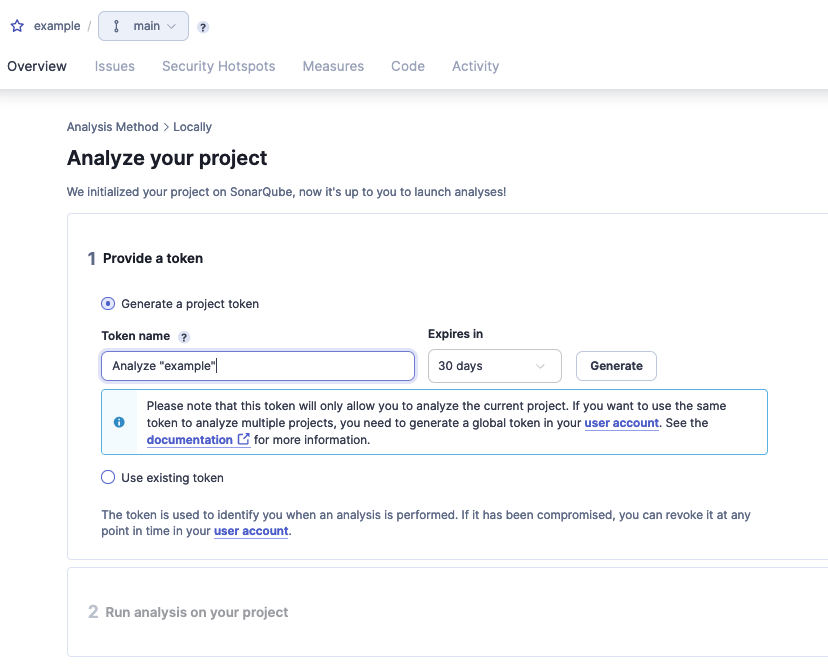
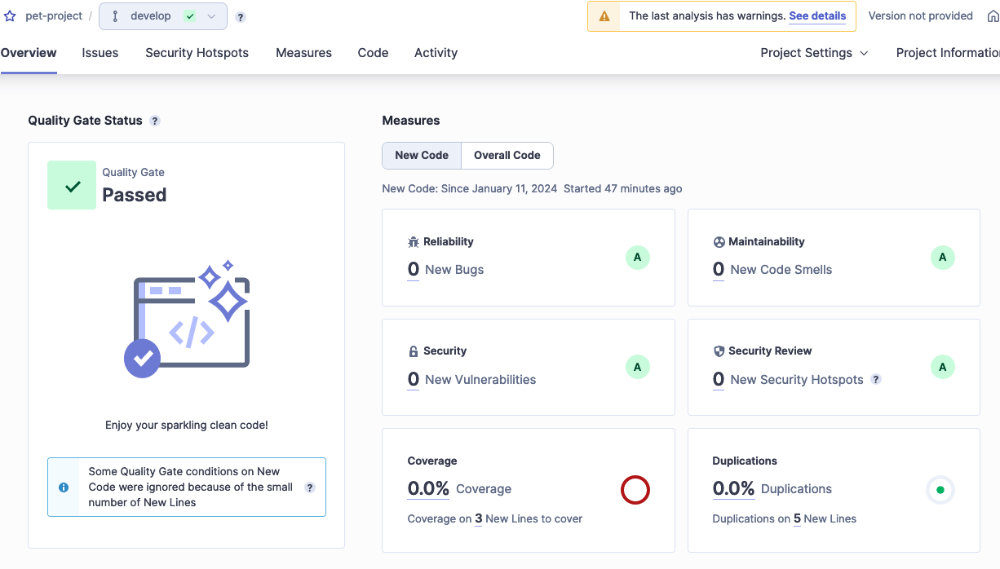

# SonarQube Analysis Report

## Introduction

This report documents the process of running a SonarQube analysis on a sample project using SonarQube's Docker container. It covers steps from running the container to analyzing a project and correcting issues.

## 1. Run SonarQube Docker Container

SonarQube was set up in a Docker container following the official [SonarQube documentation](https://docs.sonarqube.org/latest/).

### Steps:

1. Pulled the SonarQube Docker image and ran the container.
2. Verified the container was running successfully.

### Screenshot:

## 2. Login to SonarQube Web Interface

Accessed the SonarQube web interface and logged in using the default credentials.

### Steps:

1. Navigated to the SonarQube web interface.
2. Logged in with the username and default password (`admin`).

### Screenshot:

## 3. Configure a New Project

Configured a new project in SonarQube with the provided token.

### Steps:

1. Selected the option to create a new project.
2. Used the token `****` for project configuration.

### Screenshot:

## 4. Analyze Your Pet Project with SonarQube

Analyzed a pet project using SonarQube and the generated token. Followed instructions from [SonarScanner for Maven](https://docs.sonarqube.org/latest/analysis/scan/sonarscanner-for-maven/).

### Steps:

1. Prepared the pet project for SonarQube analysis.
2. Ran the SonarScanner for Maven to analyze the project.
3. Reviewed the analysis results in the SonarQube dashboard.

### Screenshot:

## 
